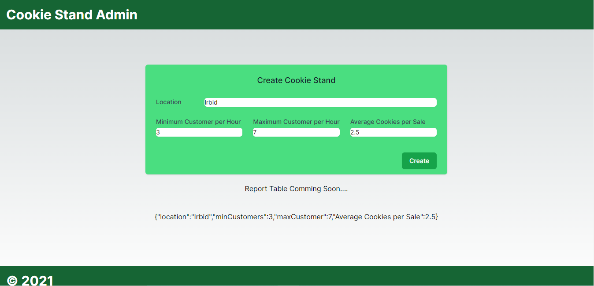

# Cookie Stand Admin 

## Overview

This Next Js app that uses An APIs that was created in Cookie Stand API Project in .Net Core 7, and it will use the deployed link in Azure to get this APIs.

## Feature Tasks and Requirements
The spec:
pages/Index.js should…

Have `Head` component with page title set to Cookie Stand Admin

Have a header component that matches spec.

Have a `main` component containing `form` and a placeholder component showing JSON string of last created Cookie Stand.

Have a `footer` component that matches spec.

Style app using TailwindCSS utility classes.
