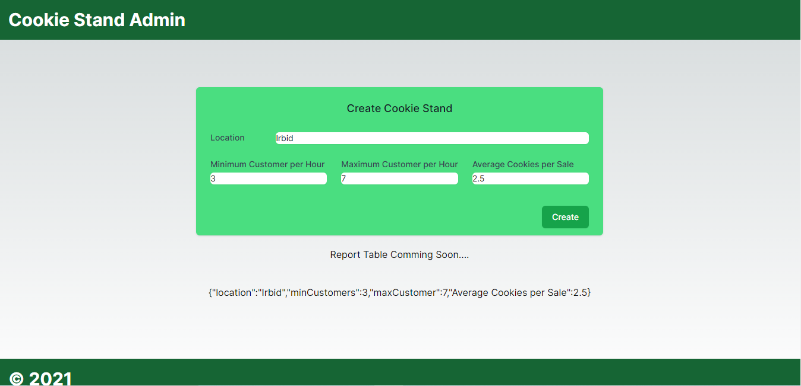
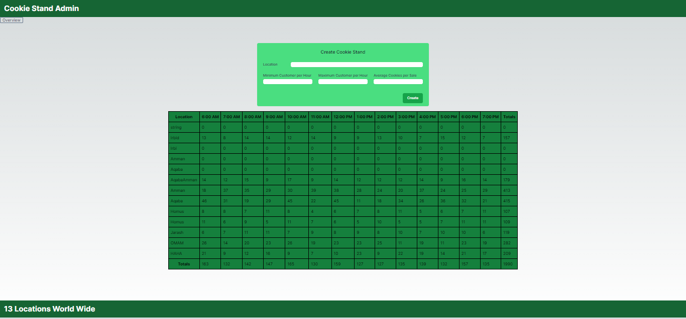

# Cookie Stand Admin 

## Overview

This Next Js app that uses An APIs that was created in Cookie Stand API Project in .Net Core 7, and it will use the deployed link in Azure to get this APIs.

## Feature Tasks and Requirements
The spec:
pages/Index.js should…

Have `Head` component with page title set to Cookie Stand Admin

Have a header component that matches spec.

Have a `main` component containing `form` and a placeholder component showing JSON string of last created Cookie Stand.

Have a `footer` component that matches spec.

Style app using TailwindCSS utility classes.

---

## Lab 38 Updates: Feature Tasks and Requirements

The specs for lab are screen shots Cookie Stand Admin Version 2 and Cookie Stand Admin No Stands
* pages/Index.js should return top level component `<CookieStandAdmin>`
`<CookieStandAdmin>` details…
* Have a `<Head>` component.
* Have a custom `<Header>` component that matches spec.
* Have a `<main>` component.
* Within `<main>` have custom `<CreateForm>` and `<ReportTable>` components.
* Have a custom `<Footer>` component that matches spec.
* Import time slot data from supplied data.js file.
* `<Head>` should set page title Cookie Stand Admin
* `<Header>` component should have Next `<Link>` to overview page.
* `<CreateForm>` component details…
* Receive an onCreate function to be called when form is submitted.
   * onCreate should be passed argument object representing new cookie stand.
   * Object should have location property.
   * Object should have hourly_sales property with hard coded [48, 42, 30, 24, 42, 24, 36, 42, 42, 48, 36, 42, 24, 36]
   
* `<ReportTable>` details…
   * should receive hours on props that is an array cookie stand hours of operation.
   * should receive reports on props that is an array all cookie stand objects.
   * If reports is empty then render `<h2>`No Cookie Stands Available`</h2>`
   * If reports is not empty then render a table with thead,tbody and tfoot components.

* Component should render to match spec.
* Component is responsible for tallying totals for each cookie stand as well as all cookie stands per hourly slot.
* `<Footer>` component details…
  * Should receive reports array on props.
  * Should display X Locations World Wide where X is number of cookie stands.
* `<Header>`,`<Footer>`,`<CreateForm>` and `<ReportTable> `should each be in own file inside top level components folder.
* Those components should be imported into Index.js
Overview page details…
  * should live in pages/overview.js
  * should render `<Link href="/"><a>Return to Main page</a></Link>`
* Style all components using TailwindCSS utility classes to match spec.

---